# Diagrams

## General Diagram — Block-Level Interconnections

```mermaid
flowchart LR
    subgraph PHYS[Physical Front-End]
        mic[MAX9814 Mic] --> esp[ESP32\nADC + Q15]
    end

    subgraph B1[Block 1 — Front-End & Packing]
        sb[sample_buffer] --> pack[pack_real_to_complex]
    end

    subgraph B2[Block 2 — Memory & Bit-Reverse]
        ctrl[permutation_controller] --> ram[dual_port_ram_buffer]
        br[bit_reverse] --> ctrl
    end

    subgraph B3[Block 3 — Math Unit & Twiddle ROM]
        tfft[twiddle_rom\nFFT: Wk_1024]
        trec[twiddle_rom\nRecomb: Wk_2048]
        bfly[butterfly_radix2]
    end

    subgraph B4[Block 4 — Complex FFT Core Controller]
        wmem[working_memory\nping-pong RAM] --> core[complex_fft_core]
        stage[fft_stage_controller] --> core
    end

    subgraph B5[Block 5 — RFFT Post-Processing & Magnitude]
        recomb[rfft_recombine] --> mag[magnitude_calc]
    end

    PHYS -->|"q15_data[15:0]\nq15_clk"| B1
    B1 -->|"complex_real[15:0]\ncomplex_imag[15:0]\ncomplex_valid, frame_start"| B2
    B2 -->|"br_real[15:0]\nbr_imag[15:0]\nbr_valid, br_ready"| B4
    B3 -->|"tw_data_fft[31:0]"| B4
    B3 -->|"tw_data_recomb[31:0]"| B5
    B4 -->|"e_r/i, o_r/i, tw_r/i\nbutterfly_en"| B3
    B3 -->|"z1_r/i, z2_r/i\nbutterfly_done"| B4
    B4 -->|"fft_real[15:0]\nfft_imag[15:0]\nfft_valid, fft_done"| B5
    B5 -->|"bin_index[10:0]\nbin_value[15:0]\nbin_valid"| OUT[Display / UART]
```

### Legend

| Block | Owner | Function |
|---|---|---|
| Block 1 | Developer 1 | ESP32 front-end capture, Q15 packing (2048 real → 1024 complex) |
| Block 2 | Developer 2 | Bit-reverse reordering, dual-port RAM buffer |
| Block 3 | Developer 3 | Twiddle ROM (Wk_1024 + Wk_2048), radix-2 butterfly (4 DSP, saturating) |
| Block 4 | Developer 4 | 10-stage DIT complex FFT core, ping-pong working memory |
| Block 5 | Developer 5 | RFFT recombination (1024 → 1025 bins), magnitude computation |
