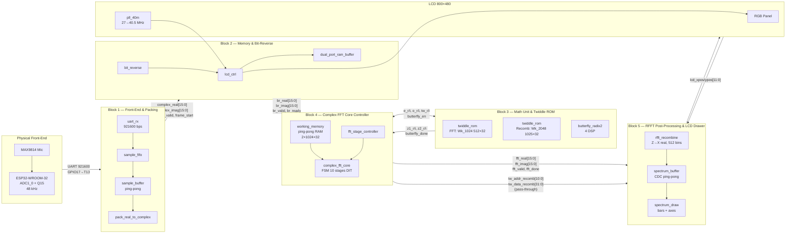

# Diagrams

## General Diagram — Block-Level Interconnections (implementación final/)



### Architecture Notes

1. **UART input** replaces the original GPIO `q15_data`/`q15_clk` toggle protocol. ESP32 streams frames at 921600 bps with header `0xAA 0x55` + length + 2048 Q15 samples.
2. **B3 is instantiated inside B4** (`complex_fft_core`). The recomb twiddle port passes through B4 to B5 — no separate ROM instantiation.
3. **Two clock domains:** `clk` (27 MHz, H11) for datapath; `clk_pix` (40.5 MHz, PLL) for LCD. CDC via dual-clock ping-pong RAM in `spectrum_buffer`.
4. **Recombination** reuses `butterfly_radix2` from B3. Output is decimated: only even bins (k=0,2..1022 → 512 values).
5. **Magnitude** is linear approximation (`max+min/2`, not `sqrt`) inside `spectrum_draw`.

---

## Clock Domain Diagram

```
             clk (27 MHz, H11 osc)          clk_pix (40.5 MHz, pll_40m)
  ┌─────────────────────────────┐     ┌──────────────────────────────┐
  │  B1 (UART+FIFO+Pack)        │     │                              │
  │  B2 (Bit-Reverse)           │     │  spectrum_buffer (read port) │
  │  B4 (FFT Core + B3 inside)  │     │  spectrum_draw               │
  │  B5 rfft_recombine          │     │  lcd_ctrl                    │
  │  spectrum_buffer (write)    │     │  LCD Panel (800×480)         │
  └──────────────┬──────────────┘     └──────────────┬───────────────┘
                 │                                   │
                 └── spectrum_buffer (CDC) ──────────┘
                    dual-clock ping-pong RAM
                    bank published on g_done
                    2FF synchronizer
```

---

## Data Flow (per frame, 2048 real samples)

| Step | Latency | Output |
|---|---|---|
| 1. ESP32 sends 2048 Q15 samples over UART 921600 | ~42.7 ms (48 kHz) | `uart_rx` → `sample_fifo` |
| 2. B1 packs into 1024 complex pairs | ~1024 cycles | `complex_real/imag` |
| 3. B2 writes to RAM in natural order, reads in bit-reverse | ~2048 cycles | `br_real/imag` |
| 4. B4 loads into working memory, runs 10 stages | ~5120 butterfly ops | `fft_real/imag` Z[k] |
| 5. B5 recomb: Z[k] → X[k] real bins | ~5 cycles/bin × 512 | `g_real/imag` (512 bins) |
| 6. B5 draws on LCD via `spectrum_buffer` CDC | 1 frame (40.5 MHz) | RGB pixels on LCD |

Total digital latency: negligible vs 42.7 ms audio frame time.

---

### Legend

| Block | Owner | Function |
|---|---|---|
| Block 1 | Developer 1 | UART capture (ESP32/MAX9814), FIFO, Q15 packing (2048 real → 1024 complex) |
| Block 2 | Developer 2 | Bit-reverse reordering, dual-port RAM buffer |
| Block 3 | Developer 3 | Twiddle ROM (Wk_1024 + Wk_2048), radix-2 butterfly (4 DSP, saturating Q15) |
| Block 4 | Developer 4 | 10-stage DIT complex FFT core, instantiates B3 internally, ping-pong working memory |
| Block 5 | Developer 5 | RFFT recombination (1024 complex → 512 real bins), CDC spectrum buffer, LCD drawing with static axes |
